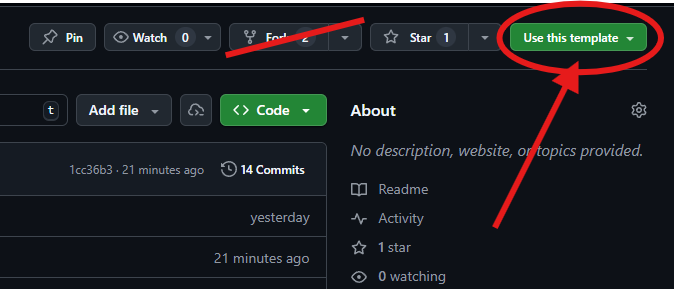

# In-class exercise: GitHub Pull Requests

## High-level goal
The high-level goal of this exercise is to learn how to do a pull request in GitHub.


### Step 1: Create Your Own Repository from This Template

**DO NOT FORK THIS REPOSITORY!**

Instead, create ONE copy for your group: 



1. Click the green **"Use this template"** button at the top of this page
2. Select **"Create a new repository"**
3. Name your repository (e.g., `pull-request-activity`)
4. Choose **Private**
5. Click **"Create repository"**
6. Add your partner(s) and **all staff** to your repo (Settings -> Collaborators).

> If you do not add staff, we will not be able to grade your assignment.

### Step 2: Clone Your Repository

```bash
git clone https://github.com/YOUR-USERNAME/pull-request-activity.git
cd pull-request-activity
```

Replace `YOUR-USERNAME` with your actual GitHub username.

## Instructions
For this activity, you will each play two roles: **pull request creator** and **pull request reviewer**.  

In Part 1, you will both start off as the pull request creator.  

In Part 2, you will review each other's pull requests.

## Part 1  
**Each Person Work Individually for Part 1**  

You are each working on a feature:  

**Person1**: you are working on a Java class for **solving the quadratic formula**.  

**Person2**: you are working on a Java class for **selling tickets**.  

If you are a third group member, read over each of the txt files listed in Part 1 Step 2 and wait until Part 2  

### 1. Each person creates a branch for their respective feature with an appropriate name (`BRANCH_NAME`).  
```bash
git checkout -b BRANCH_NAME
```  
### 2. Each person copies the contents of their feature text files into the respective Java files in src and tests

Person1: Copy the contents of `QuadraticFormulaSolver.txt` into `QuadraticFormulaSolver.java` and copy the contents of `QuadraticFormulaSolverTest.txt` into `QuadraticFormulaSolverTest.java`
```bash
cp QuadraticFormulaSolver.txt src/QuadraticFormulaSolver.java
cp QuadraticFormulaSolverTest.txt tests/QuadraticFormulaSolverTest.java
```
Person2: Copy the contents of `TicketSeller.txt` into `TicketSeller.java` and copy the contents of `TicketSellerTest.txt` into `TicketSellerTest.java`
```bash
cp TicketSeller.txt src/TicketSeller.java
cp TicketSellerTest.txt tests/TicketSellerTest.java
```

### 3. Fix the code in the highlighted section (between the comments that say "Do not modify surrounding code until the activity's Part Two")

Person1: Fix the conditional in `QuadraticFormulaSolver.java` so that the tests in `QuadraticFormulaSolverTest.java` pass. To run tests, run the script: `test_quadratic_formula_solver.sh` (`test_quadratic_formula_solver.ps1` for Windows).
```bash
./test_quadratic_formula_solver.sh
``` 

Person2: Fix the conditional in `TicketSeller.java` so that the tests in `TicketSellerTest.java` pass. To run tests, run the script: `test_ticket_seller.sh` (`test_ticket_seller.ps1` for Windows).
```bash
./test_ticket_seller.sh
```
> IMPORTANT: Do not edit the code outside of the highlighted section. Once this is done, you can  delete the comments indicating the borders of the section.

> If you get `permission denied` errors running the test scripts, try runnning `chmod +ux SCRIPT_FILE` first. If that doesn't work, try compiling the Java files with the appropriate `javac` commands. 

### 4. Commit the code (with an appropriate message `COMMIT_MESSAGE`) and create a pull request. Make sure that the CI passes.
```bash
git add src/.java
git commit -m "COMMIT_MESSAGE"
git push
```
> If `git push` gives an error about the current branch having no upstream branch, use the command given in the output (it will be something like `git push --set-upstream origin BRANCH_NAME`).

Follow the GitHub link shown in the output after pushing your branch to create your pull request.

Refer to the slides for more details on creating quality pull requests

## Part 2  
Review your partner's pull request for any improvements. This includes formatting, missing documentation, security leaks, etc. Leave inline comments wherever you spot a problem. For groups of three, Partner1 and Partner2 review each other's pull requests, and Partner3 reviews both pull requests (Partner3 should leave at least one inline comment in each).
   
Now have the pull request creator (the person who made the pull request in Part 1) review the comments made to their pull request and make appropriate changes to the code. Commit and push the changes.
  
Repeat this until you agree the file is ready for production! Once it's ready, the pull request creator should squash and merge the pull request. All done!
  
Make sure you submit a link to your repository in your pdf, and give all staff access!
